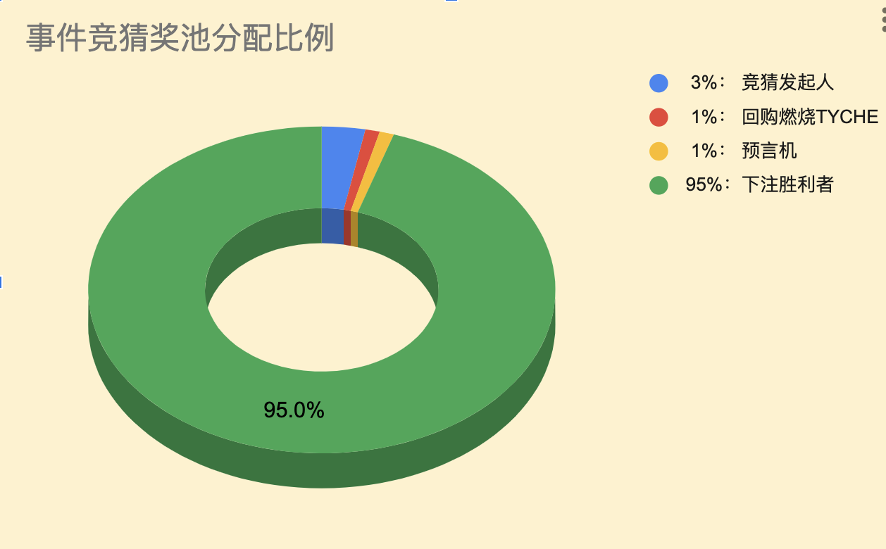

`TycheFi Bet White Paper`

# 天池金融事件竞猜白皮书

## 协议介绍

事件竞猜是世界级的现象，可以是任何一个用户发起一个事件竞猜，让其他人来参与判断一个事件未来的结果。判断胜利者可以一起瓜分投入到事件竞猜对应奖池里面的投注金额，而失败者损失掉他们自己的投注金。

本协议提供一个去中心化的解决方案，让事件竞猜的四个基本环节(`发起|下注|赛果|开奖`)都通过去中心化技术来实现和保障安全和用户隐私，最后实现整个过程的公平、公正、开放、透明和高效的执行。

## 协议环节

1、`发起竞猜`

人人都可以发起竞猜，本协议提供一个公平公正的实现流程。发起人可以在自己的社区进行推广自己发起的事件竞猜，并在竞猜流程成功进入开奖阶段，发起人可以获得相应比例的奖励。当然发起人也可以自己参与投注成为其中的一个玩家。

每个事件竞猜需要在发起时候设置一个截止时间，通常是该未来事件确定会产生结果的时间。事件竞猜的截止时间可以延后但不能提前。同时每个事件竞猜也可以设置一个起效时间，默认为事件竞猜的创建时间。一旦起效时间到达，立即开放给大众参与下注。

发起事件竞猜必须满足以下条件：

- 竞猜的事件结果在发起时还没发生，但是会在既定未来时间节点上必定发生；
- 竞猜的事件结果是普通大众可做出公正无异议的、确定性的唯一判断的；
- 竞猜事件的结果支持多个选项，但是最后结果必须是其中的唯一选项。

```
举例：2024年11月份的美国总统大选选举结果可以作为一个事件竞猜的范例（本文在2024年10月编写）
```

2、`下注竞猜`

人人可以参与竞猜下注，通过打入`$USDT`或者以`$USDT`为锚定的某条链上的映射币参与下注。下注的数量大小不限，但是仅限整数，也就是至少`1USDT`下注。如果用户打入带小数尾数的金额，则只是记录整数部分，如有小数部分则作为开发者奖励收取。除了USDT，同一个竞猜合约可以接受其它不同的币，比如`$USDC`，`$BTC`，`$ETH`等，但是不同的币需要在不同的池里面分别统计和分配。

如果押注成功，则参与瓜分奖池里面所有的金额。否则，押注者会损失全部的押注金额。

本协议支持同一个下注者对一个竞猜合约的多个结果选项同时下注。

下注的开始时间为事件竞猜合约的起效时间。

在未来考虑允许竞猜发起者设置下注人的身份限制，比如说必须是完成`DID`链上去中心化实名的用户参与，或者是拥有某种NFT的链上账户才能参与下注。

3、`喂入赛果`

人人可以参与成为事件竞猜的预言机，对某个事件竞猜喂入事件最终发生的结果。但是预言机喂入合约事件结果的时候，需要同时打入`1 TYCHE`，否则无法喂入结果。最后赛果喂入正确，则退回打入的`1 TYCHE`给预言机并且相应奖励预言机。反之，如果喂入了错误的结果，预言机打入的`1 TYCHE`会被销毁，也不会被奖励。

喂入赛果的时间是在事件竞猜的截止时间后的`24小时`内，超过这个时间，无法继续喂入赛果或者更改赛果。

4、`竞猜开奖`

在事件竞猜的完成赛果喂入之后的3天内为赛果公示时间，在这个时间内允许任何一方提出对赛果的异议。有异议者需要转入`100 TYCHE`进入该竞猜事件合约，提出不同的结果。然后竞猜合约的多签管理员参与判断，做出最后的仲裁。如果异议提出者的结果被接受，则打入的`100 TYCHE`被退回，否则被燃烧销毁。

在公示期结束后，立即进入竞猜开奖时间。所有下注押队结果的人都可以对该竞猜合约申领奖励，参与瓜分该竞猜奖池里面所有的金额。而下注押错结果的人则无法参与，并相应损失自己的押注金额。

## 奖励分配

为了激励本协议参与各方的主动积极参与，本协议提供以下分配奖励方案：

