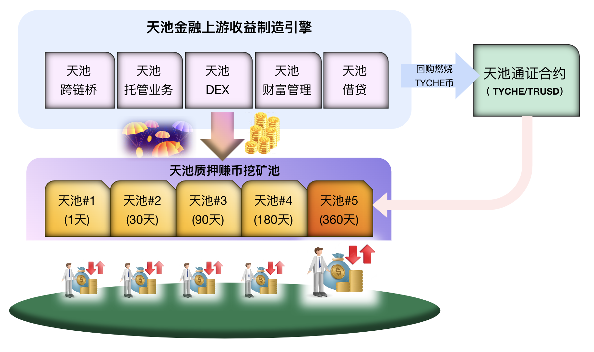

`TycheFi White Paper`

# 天池金融白皮书

## 行业背景
当今全球经济由于种种原因进入一个大的下行周期，整体经济因此产生通缩和消费降级。大部分用户不仅缺乏金融知识和专业的投资理财技能，也十分缺乏优良投资理财标的物来获得中长期的可靠收益。少数用户出于侥幸心理而追求暴利暴富，却大概率遭受严重损失。全球无数用户对未来经济发展和财富积累产生迷茫并失去了方向。

`天池金融`团队成立在这样的一个大环境下，通过运用专业分析，包括对宏观面、基本面和技术面等综合分析，坚信在加密资产和全球经济的大周期中必将孕育新的巨大机会。而走出下行周期的全球经济必将因为广泛采用区块链技术更具有弹性并发展出超大规模，现在正是布局未来的好时机。`天池金融`聚集了一群专业金融交易和宏观经济分析人员，通过专业团队的资产组合管理短中长周期收益产品投资以及精准的风险把控，创造可靠收益产品，来满足全球用户增长财富的需求。

## 天池金融核心团队

`天池金融`由一群资深金融专业人士、区块链技术极客、DeFi科学家、大数据和人工智能分析师、安全风控专家等组成，旨在建立一个长期发展的业务高效精炼的专业化团队。天池金融聚焦全球万亿美金初步规模的加密资产领域，通过建设全球顶级专业化金融和财富管理平台，为全球投资者创造持久可靠的财富。

## 天池金融核心价值观

`天池金融`核心团队深信利他精神，秉承绝不做恶原则，追求创造稳健安全可靠的收益，带领社区用户走上共同致富和长久发展的康庄大道。

## 天池金融核心业务形态

1. 提供多种周期锁仓的`天池财富`矿池给前端用户参与简单投资理财，用户投资币种主要为具有全球共识的稳定币资金类型，所有后端专业操作交由天池金融团队处理；
2. 天赐财富的矿池按照投入锁仓时间划分不同矿池，实现动态年化收益（APY: `2～20%`），其中锁仓时间越长和投入资金量越大的收益率相对越高；
3. 天池金融发行底层股权代币`$TYCHE`，通过用户参与360天矿池挖矿的用户在每次投入资金时候发放相应比例的代币，也就是实现投资挖矿`$TYCHE`的机制；
4. 天池金融未来也会提供借贷类产品，让用户实现链上质押借贷，获得的稳定币可以用于其它需求。

以下是`天池金融`的平台级产品业务架构形态:

 
<b>图1：天池金融业务总体架构</b>

## 天池财富的产品模型

`天赐财富`的矿池按照投入锁仓时间区分为以下五个矿池：
- `天池#1`: 锁仓1天
- `天池#2`: 锁仓30天
- `天池#3`: 锁仓90天
- `天池#4`: 锁仓180天
- `天池#5`: 锁仓360天，同时也是`$TYCHE`股权挖矿池。

以下是天池的用户操作和分配规则：
- 投资用户可以选择某一个或者多个矿池操作，投入相应指定币种参与赚息挖矿；
- 所有锁仓资金到期后才能赎回，且赎回时必须是100%赎回，同时伴随相应挖矿利息和可能分配的额外未领取奖励一起返回；
- 用户无法提前赎回池内质押资产，只有自上次质押后该池锁仓时间完成后才能赎回；
- 用户可以对任何池子追加质押以获得更大池内分配股份，但是每次操作会导致锁仓起始时间重置为本次的操作时间；
- 如果用户在某个池子到期后不赎回，则仍然享受该池子的动态收益利率；
- 每天天池财富总池会被投入定额利息，然后按照各池股份占比分配利息；
- 如果有空投活动，当日财富总池会被投入相应空投激励代币，然后按照各池股份占比分配该空投币数量；
- 所有各大天池池内的用户按照各自的投资占比以及投入时长获得相应的占比来瓜分每日池内分配的利息和其它额外可能的空投激励代币；

质押凭证稳定币`TRUSD`说明：
- 用户每打入一定数量的`$USDT`进入天池矿池，都将反弹出同等数量的1:1价值锚定`$USD`的数字稳定币`$TRUSD`给到用户的账户；
- 用户可以用`$TRUSD`来参与其它支持该稳定币的使用场景，例如在`TrueDEX`作为稳定币使用购买其它资产；
- 用户希望赎回在天池质押的原有稳定币资产的时候，需要按照原有数量打入`$TRUSD`方可获得里面原有质押数量；
- 非质押用户获得的`$TRUSD`则无法打入天池矿池来获取本金和收益，而只能在其它场景内使用。

平台激励说明：
- 在满足了最低总体收益水平的基础上，平台将会对各矿池不时地分配平台总体收益部分的额外分红激励，来大力提升其收益`APY`；
- 平台根据天池`TrueDEX`与第三方项目方合作的情况，将项目方所贡献的代币空投到所有矿池作为额外激励；
- 天池`#5`矿池实现质押双挖效果, 其收益除了总体平台激励收益外还有`$TYCHE`本身未来巨大的价值上升空间；
- 天池`#5`矿池内每100USDT投入即可挖得`1`枚`TYCHE`，其中`0.9`枚同步锁仓在池内，`0.1`枚进入用户钱包。

## 天池金融后端业务范围
`天池金融`将平台拥有资金包括自有资金和用户投资`天池财富`矿池的资金进行以下科学合理地组合投资管理：

| 投资理财类型                        | 风险类型  | 收益水平 | 收益周期 | 资金使用占比 |
| --------------------------------- | ------- | ------- | ------- | ---------- |
| 固收类理财 | 低风险 | 低收益 | D0 | `20%` |
| 量化交易（在现货/期货二级市场进行投机/套利交易）| 高风险 | 高收益 | D0 | `40%` |
| 投资二级市场流通的优良资产 | 中风险 | 高收益 | 6～12月 | `20%` |
| 投资一级市场发行的私募类优良资产 | 中风险 | 高收益 | 2～6月 | `10%` |
| 风险储备金：取自整体收益部分不参与任何投资理财 | 零风险 | 零收益 | 无 | `10%` |

* 注：资金使用占比会根据整体金融环境变化而进行合理调整.

## 天赐币通证经济

为了激励天池财富矿池的长期投资者，`天池金融`决定发行ERC20标准的`天赐币`：
- 代币符号：`TYCHE`
- 代币精度：`8位`
- 发行总量：`2100万枚`
- 代币合约：`tyche.token`
- 发行价格：`0.01 USDT`

`天赐币`的总体分配和发行如下：

|  分配对象   | 分配占比    | 分配使用目的                                            | 锁仓释放计划             |
| --------- | ---------- | ------------------------------------------------------ | --------------------- |
| 市场建设   | `2%`       | 社区空投（天池矿池中）、开拓市场、社区发展、用户支持 | 按贡献释放，无锁仓要求 |
| 创始团队   | `10%`      | 开发用户产品、理财投资业务、用户支持 | 市值每增长`$10万USDT`，则解锁1万枚`TYCHE`给团队 |
| 战略合作   | `8%`       | 理财业务合作、空投合作、挖矿合作 | 按贡献释放，无锁仓要求 |
| 天池#5质押挖矿 | `50%`   | 用户直接质押挖矿，收益+TYCHE双挖 | 按比例分配的天赐币，其中`90%`同质押币一起释放，`10%`直接释放 |
| 基金会    | `30%`       | 全部严格用于市值管理，稳定市场，推动生态建设健康发展为唯一目标 | 由`TycheFi`的DAO组织来统一管理 |

## 天赐币价值说明

持有天赐通证`$TYCHE`可以获得如下价值：
- Top-100`$TYCHE`持有者可以优先进入`天池金融`主导精选的一级市场投资机会；
- Top-1000`$TYCHE`持有者可以优先进入`天池金融`主导建设的高收益产品参与机会；
- 所有持有`$TYCHE`代币的用户可以有机会参与未来天池金融的平台和生态治理大会，共同促进平台和生态的健康和良好发展；
- 天赐金融平台承诺每年拿出净利润部分的`10%`用来回购销毁`$TYCHE`，确保其价值稳步上升，直到最后总量通缩到`100万枚`。
