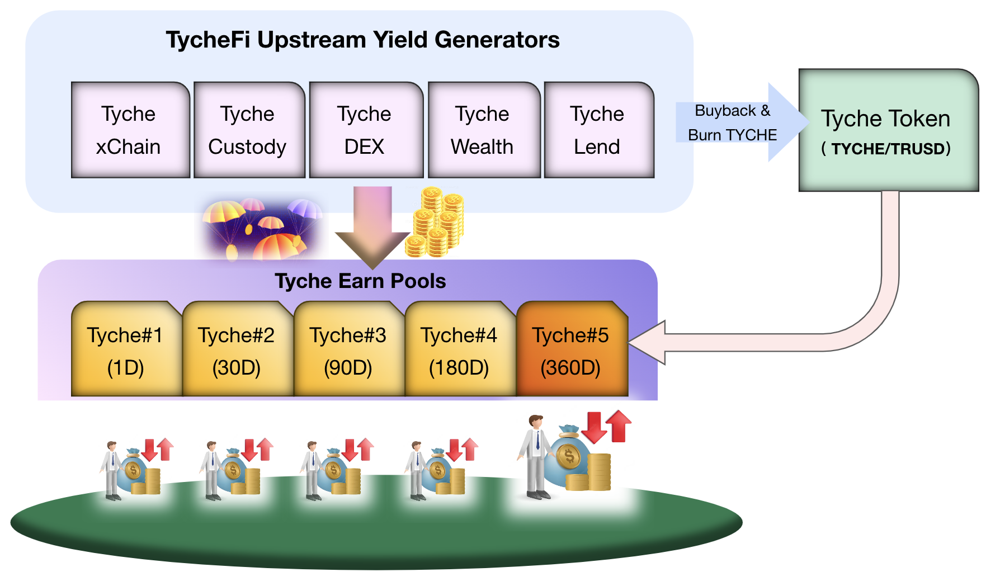
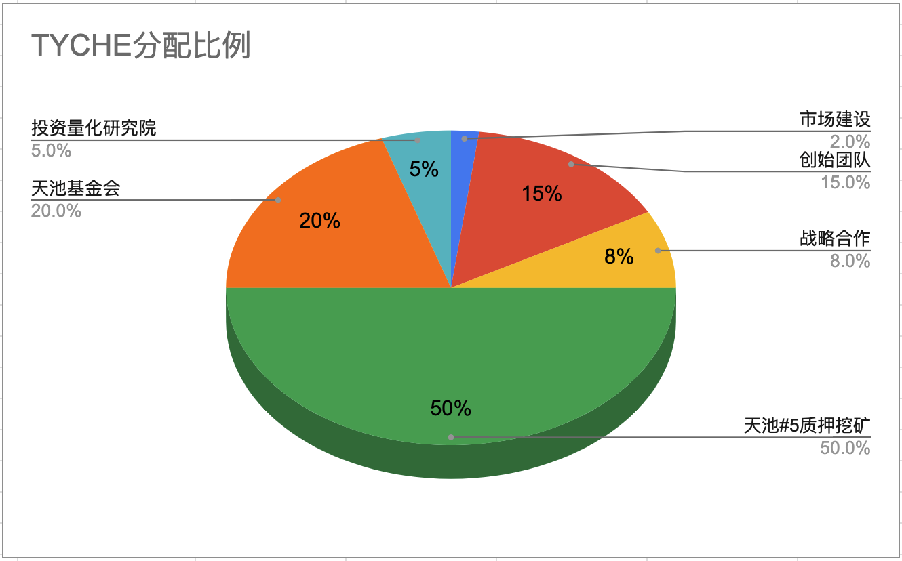

`TycheFi White Paper`

# Tyche Finance White Paper

## Industry background
The whole world economy is now getting into a downturn mode with deflation and consumption dowgrade. Most users not only lack financial knowledge and professional investment management skills, but also severely lack good investment products to obtain reliable medium-to-long term returns. Many users, out of a mentality of trying their luck, pursue huge profits, but end up suffering severe losses in most cases. Numerous users around the world feel confused about future economic development and wealth accumulation, and have lost direction. 

`Tyche Finance` (short as `TycheFi`) was founded in such a macro environment. Through the use of professional analysis, including comprehensive analysis of the macro landscape, fundamentals, and technicals, we firmly believe that new enormous opportunities will emerge in the grand cycles of crypto assets and the global economy. The global economy coming out of a downward cycle will become more resilient with the widespread adoption of blockchain technology and develop on an unprecedented scale. Now is the right time to position for the future. `TyechFi` has gathered a group of professionals in financial trading and macroeconomic analysis. Through our team's portfolio management of short, medium and long term yield generating products, and precise risk control, we create reliable income products to meet global users' needs for growing wealth.

## Core team introduction

`TycheFi` is composed of a group of seansoned senior financial professionals, blockchain tech geeks, DeFi scientists, big data and AI analysts, security and risk control experts, etc. Our goal is to build an efficient, streamlined, professionalized team focused on long-term development. `TycheFi` is focused on the global crypto asset sector, which is already worth trillions of USD. By building a top-tier professional financial and wealth management platform, we aim to create lasting wealth for investors worldwide.

## Our core value system

The core team of `TycheFi` deeply believes in altruism and the principle of never doing evil. We pursue steady, safe, and reliable returns, leading our community users onto the broad path of shared prosperity and long-term development.

## Our core business

1. Provide multiple lock-up periods for `TycheFi` Wealth mining pools (`Tyche Earn`) for end users to participate in investment activities in a very simple way. The coins invested by users are mainly stablecoins. All back-end professional operations are handled by the `TycheFi` team.
2. `TycheFi`'s wealth pools are divided into different pools according to lock-up time, realizing dynamic annualized returns (APY: 2-20%). The longer the lock-up time and the larger the amount invested, the higher the yield.
3. `TycheFi` issues an equity token $TYCHE. By participating in the 360-day mining pool, users are issued a corresponding proportion of tokens each time they invest funds, realizing an invest-to-mine $TYCHE mechanism.
4. In the future, `TycheFi` will also provide lending products, allowing users to pledge on-chain for loans and obtain stablecoins for other needs. 

Here is an overview of `TycheFi`'s platform-level product and business architecture:

 
<b>Diagram-1：TycheFi Business Architecture</b>

## TycheFi Wealth product model

Here is an overview of the `TycheFi` Wealth total mining pools (tyche.earn) divided by lock-up time:
- `TycheFi` Earn Pool#1: 1 day lockup
- `TycheFi` Earn Pool#2: 30 day lockup 
- `TycheFi` Earn Pool#3: 90 day lockup
- `TycheFi` Earn Pool#4: 180 day lockup
- `TycheFi` Earn Pool#5: 360 day lockup, also the $TYCHE equity mining pool.

Here are the operating rules and allocation for `TycheFi` users:
- Users can choose to participate in one or multiple mining pools by depositing the specified tokens to earn interest and mine.
- All locked funds can only be redeemed after maturity, and must be redeemed at 100% at once, along with earned interest and any unclaimed rewards.
- Users cannot early redeem pledged assets in the pools. Redemption is only allowed after the lockup period completes since last pledge.
- Users can make additional pledges to any pool to gain a larger share of rewards, but each pledge resets the lockup start time.
- If users do not redeem after a pool matures, they still enjoy the dynamic APY.
- A fixed interest amount is added to the `TycheFi` total wealth pool daily, and distributed proportionally based on share of each mining pool.
- Any airdrop incentives also go to the wealth pool and distributed based on mining pool share.
- All users in each mining pool receive proportional distribution based on their share of investment and lockup time for interest and airdrops.

The goal is to incentivize larger and longer deposits while allowing flexibility. Interest and incentives are distributed fairly based on proportional share of funds deposited in each pool. 

Here are the key points about the TRUSD stablecoin collateral certificate:
- For every amount of USDT deposited into `TycheFi` mining pools, an equal value of TRUSD pegged 1:1 to USD is minted and given to the user's account.
- Users can use TRUSD in other scenarios that support it, like purchasing assets on TrueDEX.
- To redeem original assets pledged in `TycheFi`, users must return the same TRUSD amount.
- TRUSD obtained without pledging cannot redeem assets/yields from `TycheFi` pools, only use in other scenarios.
- Non-pledged users can only use TRUSD in other supported scenarios, not redeem `TycheFi` assets.

Following are the key points about `TycheFi`'s incentive mechanisms:
- After meeting minimum yield levels, extra incentives from platform profits are distributed to mining pools to boost APY.
- Based on partnerships between `TycheFi`'s TrueDEX and 3rd parties, partner tokens are airdropped to all pools as added incentives.
- Pool #5 allows dual-mining of yields and $TYCHE tokens, adding future value.
- In Pool #5, every 100 USDT deposited mines 1 TYCHE token, with `0.8 TYCHE` locked in the pool and `0.2 TYCHE` given to the user.

## TycheFi Backend Business Scope
`TycheFi`team will appropriately allocate the funds including the amounts owned by the platform and raised/invested from the community users:

| Investment and Wealth Management Offerings  | Risk Type  | Yield Level | Yield Cycle | Funds Allocation Ratio |
| --------------------------------- | ------- | ------- | ------- | ---------- |
| Fixed income| Low | Low | D0 | `20%` |
| Quantative trading（Spot/Futures secondary market, speculation/arbtriage）| High | High | D0 | `40%` |
| Invest in fine assets from secondary markets | Medium | High | 6～12 months | `20%` |
| Invest in high-potential private-placement projects from primary markets | Medium | High | 2～6 months | `10%` |
| Risk reserve fund: part of overall yields, no investment usage | zero | zero | N/A | `10%` |

* Note: The allocation of funds will be reasonably adjusted according to changes in the overall financial environment.

## TYCHE tokenomics

In order to incentivize the long-term investors of TycheFi Earn Pools，`TycheFi` team decides to issue ERC-20 standard token named as `TYCHE`:
- Symbol: `TYCHE`
- Precision:`8`
- Total supply: `21 million`
- Token contract: `tyche.token`
- Issue price: `0.01 USDT`

`TYCHE` token allocation and distribution scheme:

| Allocation Target    | Ratio | Amount   | Usage & Purposes                                             | Vesting Plan          |
| -------------------- | ---------- | ---------- | ------------------------------------------------------ | --------------------- |
| Market development   | `2%`       | `0.42M`      | Community airdrops(TycheFi Pools), market & brand buildup, community development and user support | granted by contribution, no lock schedule |
| Founding team        | `15%`      | `3.15M`     | Build user products, internal investment and wealth management products, customer support etc | Initial release of `1.05 million` for product development with `2.1 million` to be unlocked to team upon every market capitalbe increase by `$10万USDT` |
| Strategic collaboration | `8%`       | `1.68M`  | Wealth management business, airdrops, pool mining etc collaboration | granted by contribution, no lock schedule |
| `TycheFi` Pool#5     | `50%`      | `10.5M`    | Users to deposit to obtain yields and `$TYCHE` as dual-mining | 1 `$TYCHE`` for every 100 `$MUSDT` or `$USDT` deposit, of which `0.9TYCHE` to be kept in the pool as the deposit and `0.9TYCHE` to be immediately released to user's account |
| Foundation (`tyche.fund`) | `25%`      | `5.25M`     | All shall be strictly used for market capital management, market stablization and healthy ecosystem development | Managed by `TycheFi` DAO |
| Investment & Quantitative Research Institute  | `5%`       | `1.05M`     | Blockchain and DeFi technology and quantative strategy and system R&D  | Initial release of `150K` for early development and the rest to be released on a contribution merit, with no lock schedule |

Following is the `TYCHE` token allocation chart:

 
<b>Diagram-2：TYCHE allocation chart</b>

## Privileges/benefits of holding `$TYCHE` tokens:

`$TYCHE` holders share the following benefits:
- Team promises to take at least `10%` of the platform profit to buyback and burn `$TYCHE` tokens from the market, to help boost the token value and ensure the ultimate circulating supply to be reduced to `1 million` only;
- All `$TYCHE` token holders can participate in `TycheFi` meetings and decision makings through `TycheFi DAO`, to help promote the healthy development of the overall platform and ecosystem;
- Top-100`$TYCHE` holders shall be shortlisted to participate `TycheFi` high-yield programs;
- Top-300`$TYCHE` holders shall be entitled to join the `TycheFi` fine-selected primary market investment programs

